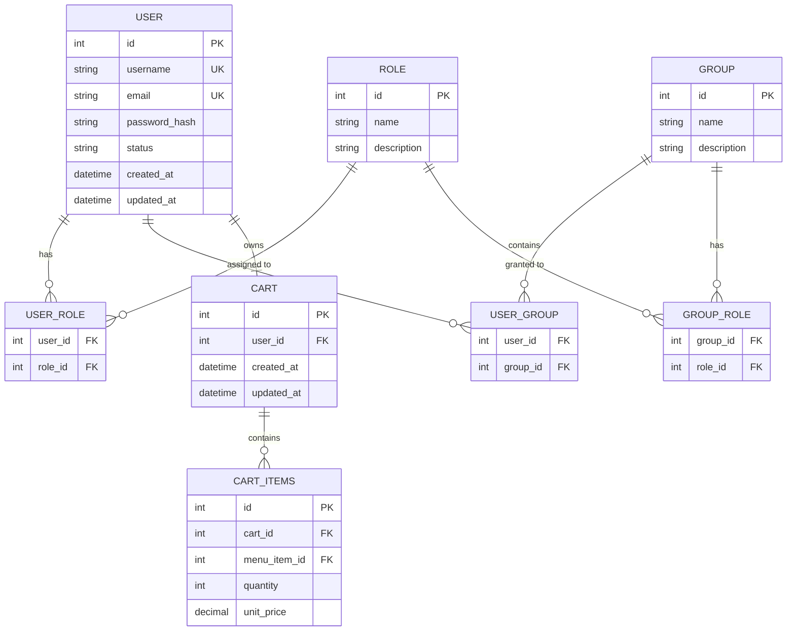
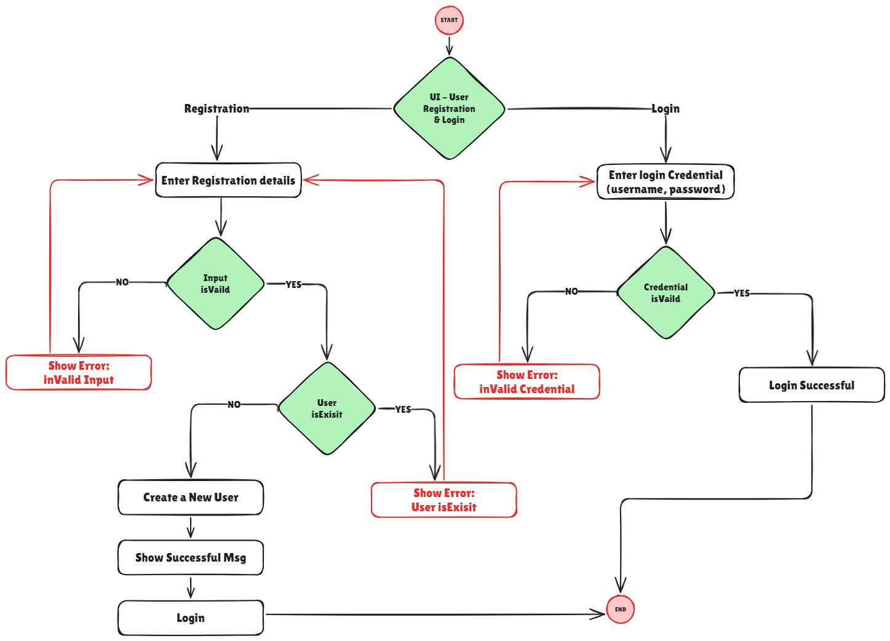
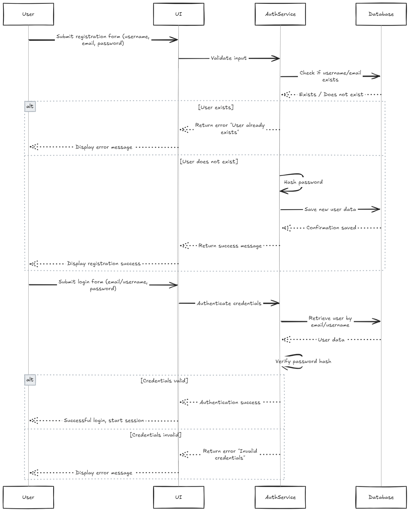

# 🍽️ **YamYam Go**

A comprehensive food delivery system that simulates modern food delivery applications, enabling users to browse restaurants, manage carts, register and authenticate, place orders, and make payments—all backed by admin dashboards and management modules.

---
## 🌟 Vision
_"YamYam Go aims to revolutionize food ordering by providing a seamless, fast, and secure platform that brings restaurants and customers together, enriched with powerful management and analytics tools for comprehensive system control."_  

---
## 🗺️ Domain Overview
**YamYam Go** is a full-fledged food delivery platform that connects customers with a variety of restaurants, offering easy menu browsing, cart and order management, secure user accounts, integrated payments, and comprehensive dashboards for restaurants and administrators.

---
## 🛠System Requirements

### ✅ Functional Requirements
- **Cart Management:** Add, update, and remove items; view order summary and totals.  
- **User Registration & Authentication:** Secure signup, login, profile management, and session handling.  
- **Restaurant Management:** Add/edit/remove restaurants, update descriptions, locations, and ratings.  
- **Menu Management:** Manage menu items, categories, details, and availability per restaurant.  
- **Order Management:** Place orders with status tracking from preparation to delivery or pickup.  
- **Customer Management:** View and edit customer profiles, order histories, and preferences.  
- **Payment Integration:** Support multiple secure payment methods with transaction validation.  
- **Dashboard:** Provide overview and controls for restaurants and system admins, including order analytics, user statistics, and notifications.  
- **Offers & Promotions:** Create and manage discount campaigns and promotional offers.

### ⚙️ Non-Functional Requirements
- High security standards for authentication and payment processing.  
- Responsive and accessible UI for multiple device types.  
- Performance optimized for concurrent user access.  
- Robust error handling and user feedback.  
- Scalable and maintainable system architecture.
### 🚫 Constraints
- User emails and usernames must be unique.  
- Payments must be validated before order confirmation.  
- Order modifications allowed only within specified time windows.  
- System should restrict access based on user roles.

---
## Actors

| Actor            | Responsibilities                                | Key Interactions                   |
| ---------------- | ----------------------------------------------- | ---------------------------------- |
| Guest User       | Browse restaurants and menus                    | Restaurant Browsing, Menu Viewing  |
| Registered User  | Place orders, manage cart and profiles          | Cart Management, Order Placement   |
| Restaurant Admin | Manage restaurant data and menus                | Restaurant & Menu Management       |
| Admin            | Oversee system, manage users, orders, analytics | Admin Dashboard, System Management |
| Payment Gateway  | Process and validate payments                   | Payment Integration                |

---
## Main Use Cases
- [x] User Registration & Authentication ✅ 
- [ ] Restaurant Browsing & Menu Viewing
- [ ] Cart Management
- [ ] Order Placement & Management
- [ ] Payment Processing
- [ ] Restaurant & Menu Management
- [ ] Customer Profile Management
- [ ] Admin and Restaurant Dashboards
- [ ] Promotional Offers Management

---
## Detailed Use Cases

### [[User Registration & Authentication]]
- Enable users to create accounts and log in securely.  
- Validate and manage sessions.  
- Provide profile editing and password recovery.

### Cart Management
- Allow customers to add/remove/update items in their cart.  
- Calculate total cost dynamically.  
- Support saving and retrieving cart state.

### Restaurant & Menu Management
- Allow admins to add or edit restaurant details and menu items.  
- Manage item categories, pricing, and availability.

### Order Management
- Allow users to place orders with selected delivery or pickup options.  
- Track order status updates throughout the fulfillment process.  
- Provide order history and details to customers.

### Customer Management
- View and update customer profiles and preferences.  
- Track user order histories and feedback.

### Payment Integration
- Integrate multiple payment options (e.g., credit card, digital wallets).  
- Securely process transactions and confirm order payments.

### Dashboard
- Provide restaurants and system admins with real-time analytics and order management tools.  
- Show key metrics: sales, orders, customer activity, and system health.  
- Enable role-based access and management.

### Offers & Promotions
- Create discount codes and promotional campaigns.  
- Track usage and effectiveness of promotions.

---

## ERD

---

## 📊 Flow Chart  

---

## 🔁 Sequence Diagram  

---

## 📃 Pseudocode
Refer to the [user-registration-login-pseudocode.md](user-registration-login-pseudocode.md) for a detailed implementation guide.

---
